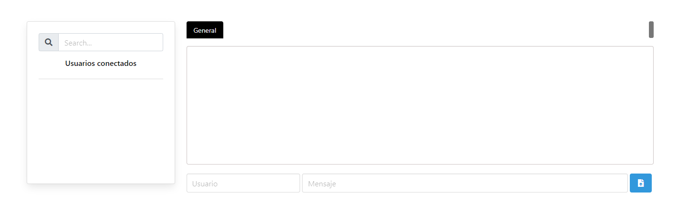

# Chat App


Project carried out with:

<br>
<br>

<a title="LanguagesUsed" target="_blank" href="#">
    
</a>

## Parameters
To start the project we execute the following:
```bash
npm start
```
| URL            | PORT |
|----------------|------|
| localhost:4000 | 4000 |

